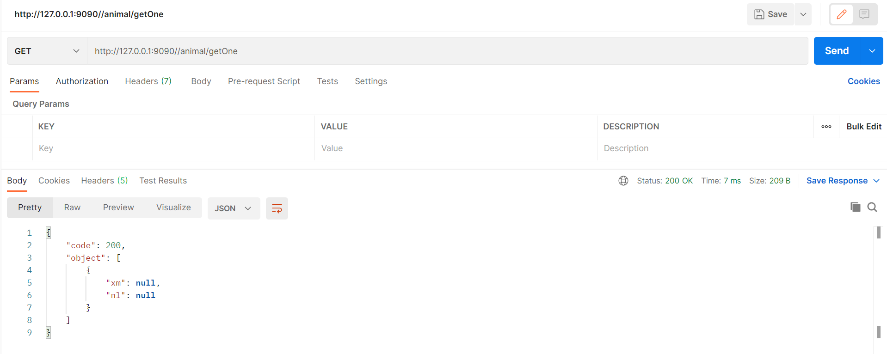
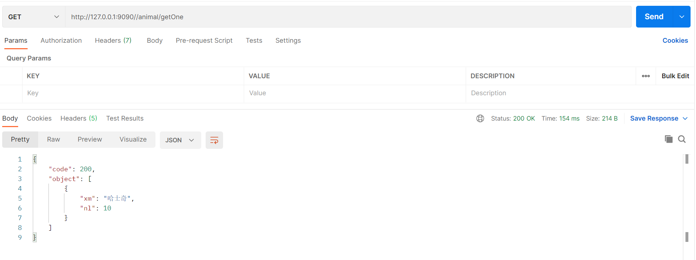

# fastjson问题复现

- 问题：[#4196](https://github.com/alibaba/fastjson/issues/4196)

- 问题出现前因后果：

  ```
  因最近FastJson爆出漏洞，所以直接从1.2.47升级到2.0.5。升级后，使用jackson的JsonProperty注解的字段，接口返回时字段值为null，降回原版本后，又可以正常返回值。jackson版本为2.11.3。
  ```

- 复现后，发现bug触发机制：

  使用``fastjson（2.0.5）``相关工具类，将json字符串反序列化，转为实体后，该实体使用springboot默认的``jackson``序列化，返回给前端，此时，该实体中使用``@JsonProperty``注解的字段，其返回值全部为``null``，但使用``fastjson（1.2.47）``时，不存在此bug。

## 测试示例

## fastjson（2.0.5）



## fastjson（1.2.47）

